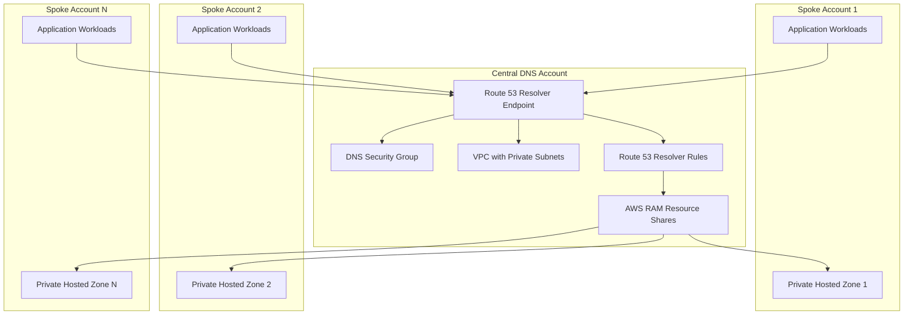

<!-- markdownlint-disable -->

<a href="https://www.appvia.io/"></a><br/><p align="right"> <a href="https://registry.terraform.io/modules/appvia/dns/aws/latest"></a></a> <a href="https://github.com/appvia/terraform-aws-dns/releases/latest"></a> <a href="https://appvia-community.slack.com/join/shared_invite/zt-1s7i7xy85-T155drryqU56emm09ojMVA#/shared-invite/email"></a> <a href="https://github.com/appvia/terraform-aws-dns/graphs/contributors"></a>

<!-- markdownlint-restore -->
<!--
  ***** CAUTION: DO NOT EDIT ABOVE THIS LINE ******
-->


# Terraform AWS Central DNS

## Overview

The Terraform AWS Central DNS module provides a comprehensive solution for managing centralized DNS resolution across AWS Organizations. This module creates and manages Route 53 Resolver endpoints, rules, and AWS Resource Access Manager (RAM) shares to enable seamless DNS resolution between private hosted zones across multiple AWS accounts and organizational units.

## Purpose & Intent

### **Problem Statement**

In large AWS Organizations with multiple accounts and organizational units, DNS resolution becomes increasingly complex:

- **Fragmented DNS Resolution**: Each account maintains its own private hosted zones, creating isolated DNS namespaces
- **Cross-Account DNS Challenges**: Applications in different accounts cannot resolve internal domain names from other accounts
- **Complex DNS Management**: Managing DNS rules and forwarding across multiple accounts requires significant operational overhead
- **Security and Compliance**: Ensuring secure DNS resolution while maintaining proper access controls across organizational boundaries
- **Scalability Issues**: As organizations grow, DNS management becomes increasingly complex and error-prone

### **Solution**

This module provides a centralized, scalable DNS solution that:

- **Centralizes DNS Management**: Creates a single point of DNS resolution for the entire organization
- **Enables Cross-Account Resolution**: Allows private hosted zones to resolve DNS queries across account boundaries
- **Simplifies DNS Operations**: Provides a unified interface for managing DNS rules and forwarding
- **Ensures Security**: Implements proper IAM controls and network security for DNS traffic
- **Scales with Organization**: Automatically shares DNS rules with specified organizational units via AWS RAM

## Key Features

### 🌐 **Centralized DNS Resolution**

- **Route 53 Resolver Endpoints**: Creates outbound resolver endpoints for DNS forwarding
- **Cross-Account DNS Support**: Enables DNS resolution between private hosted zones across accounts
- **Multi-Protocol Support**: Supports both Do53 (DNS over port 53) and DoH (DNS over HTTPS) protocols
- **IPv4/IPv6 Support**: Configurable IP address types (IPv4, IPv6, or dual-stack)

### 🔄 **Flexible Network Architecture**

- **VPC Creation or Reuse**: Option to create new VPC or reuse existing network infrastructure
- **Transit Gateway Integration**: Seamless integration with AWS Transit Gateway for multi-VPC connectivity
- **IPAM Support**: Integration with AWS IP Address Manager for IP allocation
- **Multi-AZ Deployment**: Ensures high availability across multiple availability zones

### 🔐 **Secure Resource Sharing**

- **AWS RAM Integration**: Shares DNS resolver rules with organizational units via Resource Access Manager
- **Principals Management**: Configurable sharing with specific OUs, accounts, or external principals
- **Access Control**: Granular control over which resources can access specific DNS rules
- **External Principal Support**: Optional support for sharing with external AWS accounts

### 📊 **Advanced DNS Management**

- **Rule Groups**: Organize DNS rules into logical groups for better management
- **Custom Targets**: Configurable DNS forwarding targets (defaults to VPC DNS resolver)
- **Zone Associations**: Associate Route 53 private hosted zones with the resolver VPC
- **Rule Types**: Support for different resolver rule types (currently FORWARD)

### 🛡️ **Security & Compliance**

- **Security Groups**: Automatically configured security groups for DNS traffic
- **Network Isolation**: DNS traffic restricted to private subnets and internal networks
- **IAM Integration**: Proper IAM roles and permissions for all resources
- **Audit Trail**: Comprehensive logging and monitoring capabilities

### ⚙️ **Operational Excellence**

- **Terraform State Management**: Full Terraform state management for all resources
- **Resource Tagging**: Consistent tagging across all created resources
- **Output Management**: Comprehensive outputs for integration with other modules
- **Dependency Management**: Proper resource dependencies and lifecycle management

## Architecture

### **System Components**



### **Data Flow**

1. **DNS Query Initiation**: Application in spoke account initiates DNS query
2. **Resolver Endpoint**: Query is forwarded to central DNS resolver endpoint
3. **Rule Processing**: Resolver applies configured rules to determine forwarding target
4. **Cross-Account Resolution**: Query is forwarded to appropriate private hosted zone
5. **Response Routing**: DNS response is routed back through the resolver to originating application

### **Network Architecture**

- **Central VPC**: Houses the Route 53 Resolver endpoint and associated resources
- **Private Subnets**: Resolver endpoints deployed across multiple AZs for high availability
- **Security Groups**: Restrict DNS traffic to internal networks (10.0.0.0/8)
- **Transit Gateway**: Optional connectivity to spoke VPCs for broader DNS resolution

## Usage

### **Basic Usage - Complete Infrastructure**

```hcl
module "central_dns" {
  source = "appvia/dns/aws"
  version = "0.1.0"

  resolver_name = "central-dns-resolver"
  tags = {
    Environment = "production"
    ManagedBy   = "terraform"
    Purpose     = "central-dns"
  }

  resolver_rule_groups = [
    {
      ram_share_name = "internal-domains"
      ram_principals = {
        "Development" = "arn:aws:organizations::123456789012:ou/o-abc123/ou-dev-123"
        "Production"  = "arn:aws:organizations::123456789012:ou/o-abc123/ou-prod-456"
      }
      rules = [
        {
          name   = "internal-corp"
          domain = "corp.internal"
        },
        {
          name   = "development"
          domain = "dev.internal"
        }
      ]
    }
  ]

  network = {
    availability_zones = 2
    transit_gateway_id = var.transit_gateway_id
    private_netmask    = 24
    vpc_cidr           = "10.90.0.0/21"
  }
}
```

### **Advanced Usage - Reusing Existing Network**

```hcl
# Create network separately for reuse
module "dns_network" {
  source  = "appvia/network/aws"
  version = "0.6.10"

  availability_zones = 3
  name              = "central-dns-network"
  vpc_cidr          = "10.90.0.0/21"
  transit_gateway_id = var.transit_gateway_id
  
  tags = var.tags
}

module "central_dns" {
  source = "appvia/dns/aws"
  version = "0.1.0"

  resolver_name = "enterprise-dns-resolver"
  
  # Advanced resolver configuration
  resolver_protocols      = ["Do53", "DoH"]
  resolver_endpoint_type  = "DUALSTACK"
  
  resolver_rule_groups = [
    {
      ram_share_name = "enterprise-domains"
      ram_principals = {
        "Infrastructure" = "arn:aws:organizations::123456789012:ou/o-abc123/ou-infra-789"
        "Applications"   = "arn:aws:organizations::123456789012:ou/o-abc123/ou-apps-012"
        "Data"          = "arn:aws:organizations::123456789012:ou/o-abc123/ou-data-345"
      }
      rules = [
        {
          name    = "enterprise-corp"
          domain  = "enterprise.corp"
          targets = ["10.1.1.1", "10.1.1.2"]  # Custom DNS servers
        },
        {
          name    = "development"
          domain  = "dev.enterprise.corp"
          targets = []  # Use default VPC resolver
        },
        {
          name    = "production"
          domain  = "prod.enterprise.corp"
          targets = ["10.2.1.1", "10.2.1.2"]
        }
      ]
    },
    {
      ram_share_name = "external-domains"
      ram_principals = {
        "All-Accounts" = "arn:aws:organizations::123456789012:ou/o-abc123/ou-all-678"
      }
      rules = [
        {
          name   = "external-forwarding"
          domain = "external.company.com"
        }
      ]
    }
  ]

  # Reuse existing network
  network = {
    create             = false
    vpc_id             = module.dns_network.vpc_id
    vpc_cidr           = module.dns_network.vpc_cidr
    private_subnet_ids = module.dns_network.private_subnet_ids
    transit_gateway_id = var.transit_gateway_id
  }

  # Associate additional private hosted zones
  route53_zone_ids = [
    "Z1234567890ABC",  # Private hosted zone from another account
    "Z0987654321DEF"   # Another private hosted zone
  ]

  tags = var.tags
}
```

### **Use Cases**

#### **1. Enterprise Multi-Account DNS**

```hcl
# For large enterprises with complex organizational structures
module "enterprise_dns" {
  source = "appvia/dns/aws"
  
  resolver_name = "enterprise-central-dns"
  
  resolver_rule_groups = [
    {
      ram_share_name = "business-domains"
      ram_principals = {
        "Finance"      = "arn:aws:organizations::123456789012:ou/o-abc123/ou-finance"
        "HR"          = "arn:aws:organizations::123456789012:ou/o-abc123/ou-hr"
        "Engineering" = "arn:aws:organizations::123456789012:ou/o-abc123/ou-engineering"
      }
      rules = [
        {
          name   = "corporate"
          domain = "corp.company.com"
        },
        {
          name   = "internal"
          domain = "internal.company.com"
        }
      ]
    }
  ]
  
  network = {
    availability_zones = 3
    transit_gateway_id = var.enterprise_tgw_id
    vpc_cidr           = "10.100.0.0/20"
  }
  
  tags = {
    Environment = "production"
    BusinessUnit = "IT"
    Compliance = "required"
  }
}
```

#### **2. Development Environment DNS**

```hcl
# For development and testing environments
module "dev_dns" {
  source = "appvia/dns/aws"
  
  resolver_name = "dev-central-dns"
  
  resolver_rule_groups = [
    {
      ram_share_name = "dev-domains"
      ram_principals = {
        "Dev-Accounts" = "arn:aws:organizations::123456789012:ou/o-abc123/ou-dev"
      }
      rules = [
        {
          name   = "dev-internal"
          domain = "dev.internal"
        },
        {
          name   = "test"
          domain = "test.internal"
        }
      ]
    }
  ]
  
  network = {
    availability_zones = 2
    vpc_cidr           = "10.200.0.0/22"
  }
  
  tags = {
    Environment = "development"
    Purpose     = "dns-resolution"
  }
}
```

#### **3. Compliance-Focused DNS**

```hcl
# For organizations with strict compliance requirements
module "compliance_dns" {
  source = "appvia/dns/aws"
  
  resolver_name = "compliance-dns-resolver"
  
  # Enhanced security with IPv6 support
  resolver_protocols     = ["Do53", "DoH"]
  resolver_endpoint_type = "DUALSTACK"
  
  resolver_rule_groups = [
    {
      ram_share_name = "compliance-domains"
      ram_principals = {
        "Compliance-Accounts" = "arn:aws:organizations::123456789012:ou/o-abc123/ou-compliance"
      }
      rules = [
        {
          name    = "secure-corp"
          domain  = "secure.corp"
          targets = ["10.1.1.1", "10.1.1.2"]  # Dedicated secure DNS servers
        }
      ]
    }
  ]
  
  network = {
    availability_zones = 3
    vpc_cidr           = "10.50.0.0/20"
    ipam_pool_id       = var.compliance_ipam_pool_id
  }
  
  tags = {
    Environment     = "production"
    Compliance      = "required"
    DataClassification = "confidential"
    AuditRequired   = "true"
  }
}
```

## Monitoring & Troubleshooting

### **CloudWatch Logs and Metrics**

The module creates comprehensive monitoring capabilities:

```bash
# View Route 53 Resolver logs
aws logs describe-log-groups --log-group-name-prefix "/aws/route53resolver"

# Monitor DNS query metrics
aws cloudwatch get-metric-statistics \
  --namespace "AWS/Route53Resolver" \
  --metric-name "Queries" \
  --dimensions Name=ResolverEndpointId,Value=rslvr-out-1234567890abcdef \
  --start-time 2023-01-01T00:00:00Z \
  --end-time 2023-01-02T00:00:00Z \
  --period 3600 \
  --statistics Sum
```

### **Key Monitoring Metrics**

| Metric | Description | Use Case |
|--------|-------------|----------|
| `Queries` | Number of DNS queries processed | Monitor DNS traffic volume |
| `QueriesBlocked` | Number of blocked queries | Security monitoring |
| `QueriesForwarded` | Number of forwarded queries | Performance monitoring |
| `QueriesProcessed` | Total queries processed | Overall health |

### **Common Issues & Solutions**

#### **1. DNS Resolution Failures**

```
Error: DNS resolution timeout for domain.example.com
```

**Solutions**:

- Verify security group rules allow DNS traffic (ports 53 TCP/UDP)
- Check that resolver rules are properly configured
- Ensure target DNS servers are reachable
- Verify RAM resource shares are accepted by target accounts

#### **2. RAM Share Issues**

```
Error: Resource share not found or access denied
```

**Solutions**:

- Verify principal ARNs are correct and valid
- Ensure RAM resource shares are accepted in target accounts
- Check IAM permissions for RAM operations
- Verify organization structure and OU IDs

#### **3. Network Connectivity Issues**

```
Error: Resolver endpoint not reachable
```

**Solutions**:

- Verify VPC and subnet configuration
- Check Transit Gateway attachments and routing
- Ensure security groups allow DNS traffic
- Verify network ACLs don't block DNS traffic

### **Testing DNS Resolution**

```bash
# Test DNS resolution from EC2 instance
dig @10.90.0.2 domain.example.com

# Test with nslookup
nslookup domain.example.com 10.90.0.2

# Test from within VPC
nslookup domain.example.com
```

### **Operational Best Practices**

1. **Monitor DNS Performance**: Set up CloudWatch alarms for query latency and error rates
2. **Regular Health Checks**: Implement automated DNS resolution tests
3. **Security Auditing**: Regularly review RAM shares and access permissions
4. **Capacity Planning**: Monitor query volumes and scale accordingly
5. **Backup and Recovery**: Document resolver configurations for disaster recovery

## Requirements

### **Prerequisites**

- AWS Organizations enabled
- Appropriate IAM permissions for Route 53, RAM, and VPC operations
- Transit Gateway (optional, for multi-VPC connectivity)
- IPAM pool (optional, for IP address management)

### **AWS Services Used**

- Route 53 Resolver
- AWS Resource Access Manager (RAM)
- Amazon VPC
- AWS Security Groups
- AWS Transit Gateway (optional)
- AWS IPAM (optional)

### **Network Requirements**

- Private subnets in multiple availability zones
- Security groups allowing DNS traffic (ports 53 TCP/UDP)
- Route tables configured for DNS traffic routing
- Optional: Transit Gateway for cross-VPC connectivity

## Update Documentation

The `terraform-docs` utility is used to generate this README. Follow the below steps to update:

1. Make changes to the `.terraform-docs.yml` file
2. Fetch the `terraform-docs` binary (<https://terraform-docs.io/user-guide/installation/>)
3. Run `terraform-docs markdown table --output-file ${PWD}/README.md --output-mode inject .`

<!-- BEGIN_TF_DOCS -->
## Providers

| Name | Version |
|------|---------|
| <a name="provider_aws"></a> [aws](#provider\_aws) | >= 5.0.0 |

## Inputs

| Name | Description | Type | Default | Required |
|------|-------------|------|---------|:--------:|
| <a name="input_network"></a> [network](#input\_network) | The network to use for the endpoints and optinal resolvers | <pre>object({<br/>    availability_zones = optional(number, 2)<br/>    # Whether to use ipam when creating the network<br/>    create = optional(bool, true)<br/>    # Indicates if we should create a new network or reuse an existing one<br/>    enable_default_route_table_association = optional(bool, true)<br/>    # Whether to associate the default route table  <br/>    enable_default_route_table_propagation = optional(bool, true)<br/>    # Whether to propagate the default route table<br/>    ipam_pool_id = optional(string, null)<br/>    # The id of the ipam pool to use when creating the network<br/>    name = optional(string, "central-dns")<br/>    # The name of the network to create<br/>    private_netmask = optional(number, 24)<br/>    # The subnet mask for private subnets, when creating the network i.e subnet-id => 10.90.0.0/24<br/>    private_subnet_ids = optional(list(string), [])<br/>    # The ids of the private subnets to if we are reusing an existing network<br/>    transit_gateway_id = optional(string, "")<br/>    ## The transit gateway id to use for the network<br/>    vpc_cidr = optional(string, "")<br/>    # The cidrws range to use for the VPC, when creating the network<br/>    vpc_id = optional(string, "")<br/>    # The vpc id to use when reusing an existing network <br/>    vpc_netmask = optional(number, null)<br/>    # When using ipam this the netmask to use for the VPC<br/>  })</pre> | n/a | yes |
| <a name="input_resolver_name"></a> [resolver\_name](#input\_resolver\_name) | Name of the Route53 resolver endpoint | `string` | n/a | yes |
| <a name="input_tags"></a> [tags](#input\_tags) | Map of tags to apply to resources created by this module | `map(string)` | n/a | yes |
| <a name="input_resolver_endpoint_type"></a> [resolver\_endpoint\_type](#input\_resolver\_endpoint\_type) | The Route 53 Resolver endpoint IP address type. Valid values: IPV4, IPV6, DUALSTACK. | `string` | `"IPV4"` | no |
| <a name="input_resolver_protocols"></a> [resolver\_protocols](#input\_resolver\_protocols) | List of protocols that the Route53 Outbound Resolver should support | `list(string)` | <pre>[<br/>  "Do53",<br/>  "DoH"<br/>]</pre> | no |
| <a name="input_resolver_rule_groups"></a> [resolver\_rule\_groups](#input\_resolver\_rule\_groups) | Map of Route53 Resolver Rules by group. Every rule in each group can be shared with principals via AWS RAM. | <pre>list(object({<br/>    ram_share_name = string<br/>    # The share share name will be the ram_share_name '-' rule_name<br/>    ram_principals = optional(map(string), {})<br/>    ## A map of principals to share the rules with i.e. Infrastructure OU => ou-1234567890<br/>    rules = list(object({<br/>      name = string<br/>      ## The name of the rule, used when creating the ram share <br/>      domain = string<br/>      ## The domain to forward the query to <br/>      targets = optional(list(string), [])<br/>      ## The name of the resolver rule<br/>      rule_type = optional(string, "FORWARD")<br/>      ## The type of rule to create <br/>    }))<br/>    ## A list of rules to create in the group <br/>  }))</pre> | `[]` | no |
| <a name="input_route53_zone_ids"></a> [route53\_zone\_ids](#input\_route53\_zone\_ids) | List of Route53 Zone IDs to be associated with the resolver VPC. | `list(string)` | `[]` | no |

## Outputs

| Name | Description |
|------|-------------|
| <a name="output_all_resolver_rules"></a> [all\_resolver\_rules](#output\_all\_resolver\_rules) | Map of all resolver rules. |
| <a name="output_endpoint"></a> [endpoint](#output\_endpoint) | Details of the Route53 Outbound Resolver endpoint. |
| <a name="output_resource_shares"></a> [resource\_shares](#output\_resource\_shares) | Map of AWS RAM Shares by group. |
| <a name="output_rules"></a> [rules](#output\_rules) | Map of resolver rules by group. |
<!-- END_TF_DOCS -->
