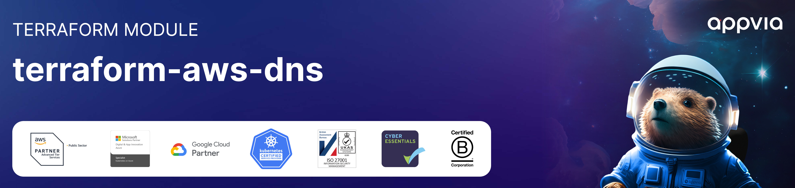

<!-- markdownlint-disable -->
<a href="https://www.appvia.io/"></a><br/><p align="right"> <a href="https://registry.terraform.io/modules/appvia/dns/aws/latest"></a></a> <a href="https://github.com/appvia/terraform-aws-dns/releases/latest"></a> <a href="https://appvia-community.slack.com/join/shared_invite/zt-1s7i7xy85-T155drryqU56emm09ojMVA#/shared-invite/email"></a> <a href="https://github.com/appvia/terraform-aws-dns/graphs/contributors"></a>

<!-- markdownlint-restore -->
<!--
  ***** CAUTION: DO NOT EDIT ABOVE THIS LINE ******
-->


# Terraform AWS Central DNS

## Description

This purpose of this module is to manage and provision a central DNS solution with an AWS estate. Under this setup all private hosted zones defined within the spoke accounts have the ability to perform DNS resolution between them.

## Usage

```hcl
module "dns" {
  source = "../../"

  resolver_name = "outbound-central-dns"
  tags          = var.tags

  resolver_rule_groups = [
    {
      ram_share_name = "internal"
      ram_principals = {
        "Deployments" = "arn:aws:organizations::536471746696:ou/o-7enwqk0f2c/ou-1tbg-mq4w830q"
        "Workloads"   = "arn:aws:organizations::536471746696:ou/o-7enwqk0f2c/ou-1tbg-lk6g79d4"
      }
      rules = [
        {
          name   = "aws-appvia-local"
          domain = "aws.appvia.local"
        }
      ]
    }
  ]

  network = {
    availability_zones = 2
    transit_gateway_id = var.transit_gateway_id
    private_netmask    = 24
    vpc_cidr           = "10.90.0.0/21"
  }
}
```

## Update Documentation

The `terraform-docs` utility is used to generate this README. Follow the below steps to update:

1. Make changes to the `.terraform-docs.yml` file
2. Fetch the `terraform-docs` binary (https://terraform-docs.io/user-guide/installation/)
3. Run `terraform-docs markdown table --output-file ${PWD}/README.md --output-mode inject .`

<!-- BEGIN_TF_DOCS -->
## Providers

| Name | Version |
|------|---------|
| <a name="provider_aws"></a> [aws](#provider\_aws) | >= 5.0.0 |

## Inputs

| Name | Description | Type | Default | Required |
|------|-------------|------|---------|:--------:|
| <a name="input_network"></a> [network](#input\_network) | The network to use for the endpoints and optinal resolvers | <pre>object({<br/>    availability_zones = optional(number, 2)<br/>    # Whether to use ipam when creating the network<br/>    create = optional(bool, true)<br/>    # Indicates if we should create a new network or reuse an existing one<br/>    enable_default_route_table_association = optional(bool, true)<br/>    # Whether to associate the default route table  <br/>    enable_default_route_table_propagation = optional(bool, true)<br/>    # Whether to propagate the default route table<br/>    ipam_pool_id = optional(string, null)<br/>    # The id of the ipam pool to use when creating the network<br/>    name = optional(string, "central-dns")<br/>    # The name of the network to create<br/>    private_netmask = optional(number, 24)<br/>    # The subnet mask for private subnets, when creating the network i.e subnet-id => 10.90.0.0/24<br/>    private_subnet_ids = optional(list(string), [])<br/>    # The ids of the private subnets to if we are reusing an existing network<br/>    transit_gateway_id = optional(string, "")<br/>    ## The transit gateway id to use for the network<br/>    vpc_cidr = optional(string, "")<br/>    # The cidrws range to use for the VPC, when creating the network<br/>    vpc_id = optional(string, "")<br/>    # The vpc id to use when reusing an existing network <br/>    vpc_netmask = optional(number, null)<br/>    # When using ipam this the netmask to use for the VPC<br/>  })</pre> | n/a | yes |
| <a name="input_resolver_name"></a> [resolver\_name](#input\_resolver\_name) | Name of the Route53 resolver endpoint | `string` | n/a | yes |
| <a name="input_tags"></a> [tags](#input\_tags) | Map of tags to apply to resources created by this module | `map(string)` | n/a | yes |
| <a name="input_resolver_endpoint_type"></a> [resolver\_endpoint\_type](#input\_resolver\_endpoint\_type) | The Route 53 Resolver endpoint IP address type. Valid values: IPV4, IPV6, DUALSTACK. | `string` | `"IPV4"` | no |
| <a name="input_resolver_protocols"></a> [resolver\_protocols](#input\_resolver\_protocols) | List of protocols that the Route53 Outbound Resolver should support | `list(string)` | <pre>[<br/>  "Do53",<br/>  "DoH"<br/>]</pre> | no |
| <a name="input_resolver_rule_groups"></a> [resolver\_rule\_groups](#input\_resolver\_rule\_groups) | Map of Route53 Resolver Rules by group. Every rule in each group can be shared with principals via AWS RAM. | <pre>list(object({<br/>    ram_share_name = string<br/>    # The share share name will be the ram_share_name '-' rule_name<br/>    ram_principals = optional(map(string), {})<br/>    ## A map of principals to share the rules with i.e. Infrastructure OU => ou-1234567890<br/>    rules = list(object({<br/>      name = string<br/>      ## The name of the rule, used when creating the ram share <br/>      domain = string<br/>      ## The domain to forward the query to <br/>      targets = optional(list(string), [])<br/>      ## The name of the resolver rule<br/>      rule_type = optional(string, "FORWARD")<br/>      ## The type of rule to create <br/>    }))<br/>    ## A list of rules to create in the group <br/>  }))</pre> | `[]` | no |
| <a name="input_route53_zone_ids"></a> [route53\_zone\_ids](#input\_route53\_zone\_ids) | List of Route53 Zone IDs to be associated with the resolver VPC. | `list(string)` | `[]` | no |

## Outputs

| Name | Description |
|------|-------------|
| <a name="output_all_resolver_rules"></a> [all\_resolver\_rules](#output\_all\_resolver\_rules) | Map of all resolver rules. |
| <a name="output_endpoint"></a> [endpoint](#output\_endpoint) | Details of the Route53 Outbound Resolver endpoint. |
| <a name="output_resource_shares"></a> [resource\_shares](#output\_resource\_shares) | Map of AWS RAM Shares by group. |
| <a name="output_rules"></a> [rules](#output\_rules) | Map of resolver rules by group. |
<!-- END_TF_DOCS -->
